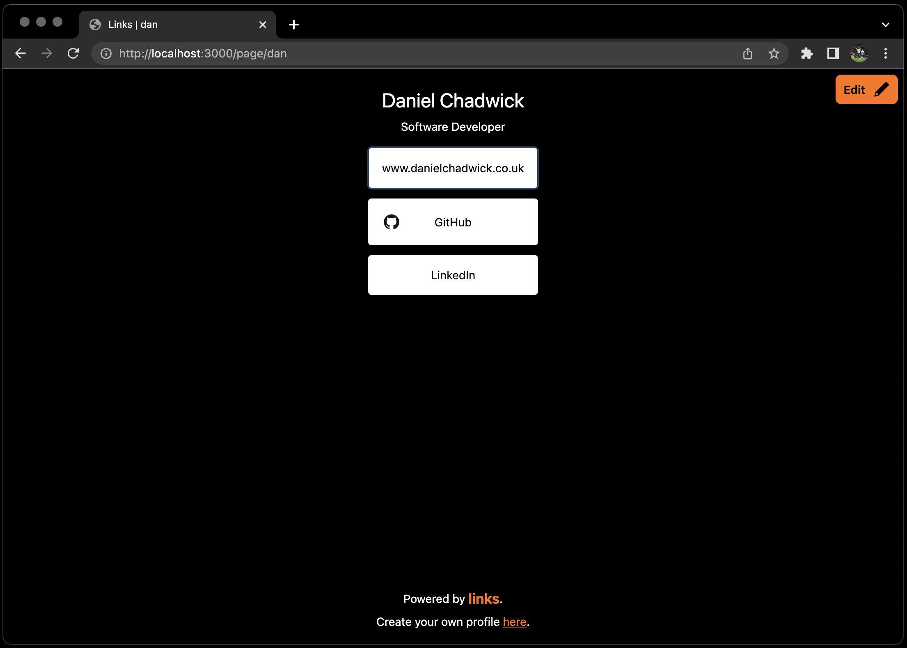
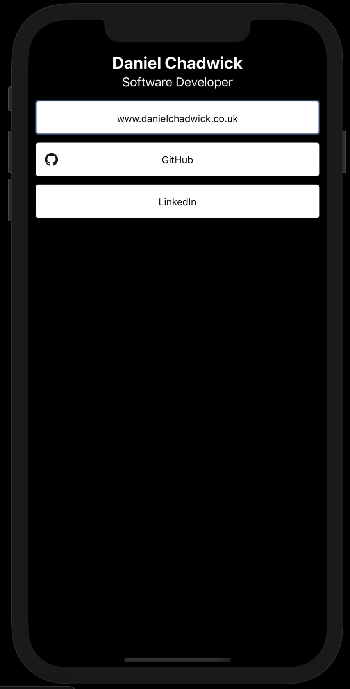
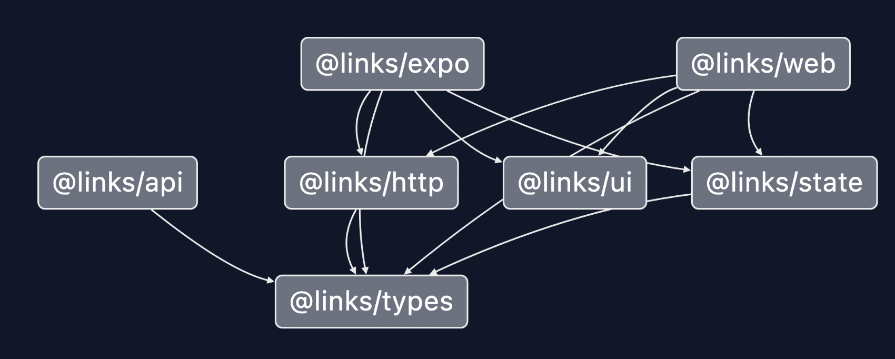
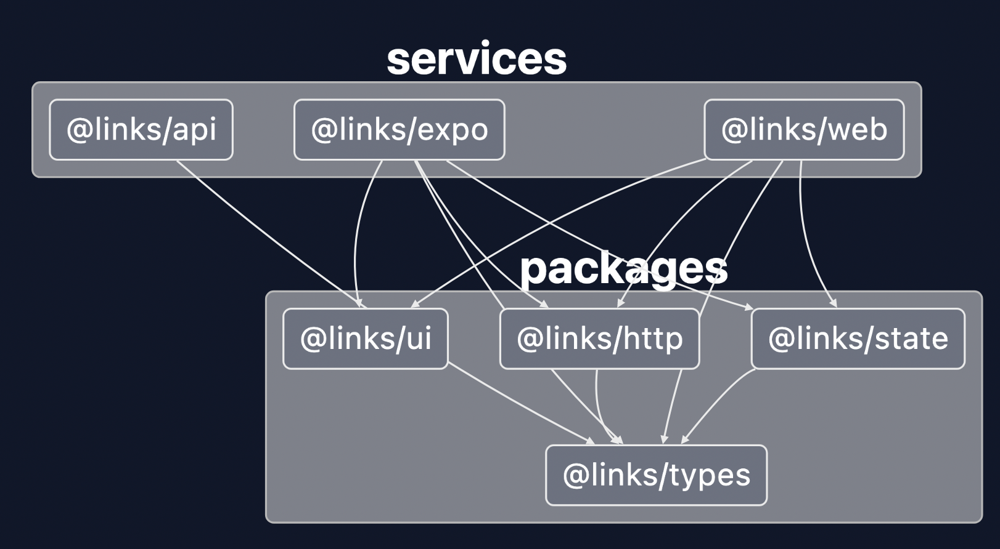

# @links

Personal home page designed to be cross platform from browser to mobile devices using React, Expo, and Lerna.

Desktop             |  Mobile
:-------------------------:|:-------------------------:
 | 


## Architecture

To achieve this, I have taken the monorepo approach leveraging Lerna, Yarn Workspaces to code once and reuse everywhere within React and React Native using NextJS and Expo respectively.

I am currently in the process of making sure code duplication is minimised where possible. The current package dependency structure can be seen below:

Package links             |  Package links (grouped by folder)
:-------------------------:|:-------------------------:
 | 


## Setup:

```
npm i
```

Then setup the monorepo:

```
lerna bootstrap
```

### Services:

To run an individual service use:

```
yarn run api:start:dev
yarn run web:start:dev
```

### Assistance

To add a new package, from the root directory:

```
lerna add <package> --scope=<service/package> [--scope=c --scope=d]
```

E.g.

```
lerna add @links/ui --scope=@links/web --dev
```

Or try:

```
yarn workspace @links/expo add react-devtools@4.22.0 --dev
```

To remove an existing package:

1. Remove it from the local package/service
2. Run the below

```
lerna bootstrap --scope=<service/package> --no-ci --force-local
```

## Documentation

To generate the dependency graph seen above, run:

```
npx graph
```